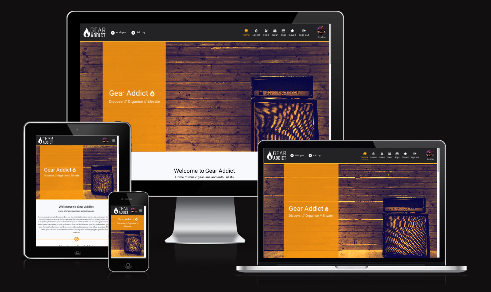
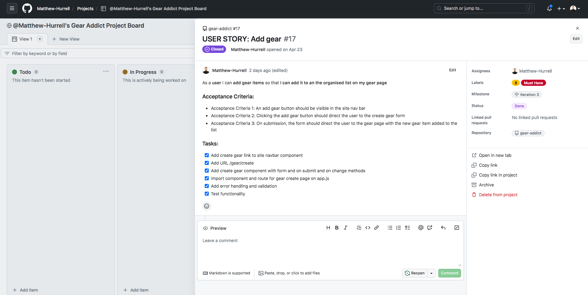
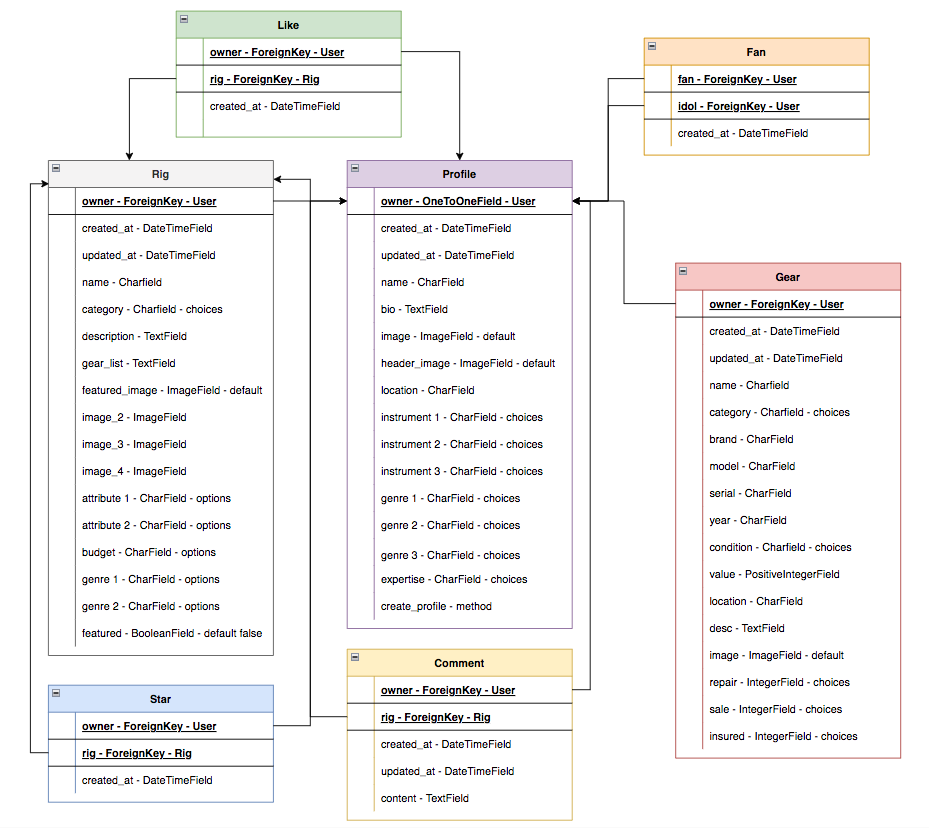
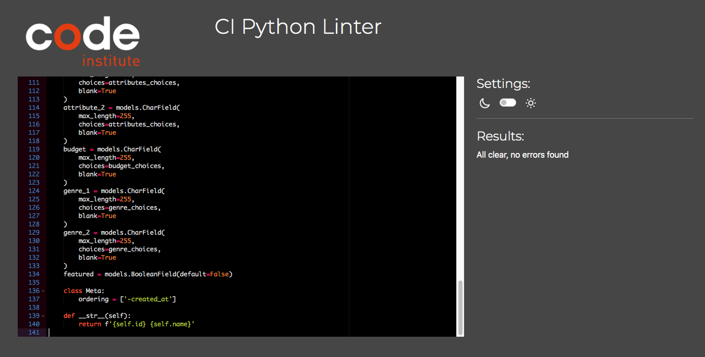

# **Gear Addict - API**

Gear Addict is an online application that allows users to add and categorise their music gear, and also share details about their live rigs with the community. Users can interact with other users by becoming a fan, as well as liking, commenting and saving rigs.

This project was built as the final portfolio submission for the [Code Institute](https://codeinstitute.net/) Higher National Diploma in Full Stack Software Development. 

The project has been split into two parts - the front-end built with [React](https://react.dev/), and the back end powered by the [Django REST Framework](https://www.django-rest-framework.org/). 

More information on the front end of the site can be found in the front end [README](https://github.com/Matthew-Hurrell/gear-addict/blob/main/README.md).

Link to the live site - [Gear Addict Live Site](https://gear-addict-react.herokuapp.com/)

Link to the live API - [Gear Addict Live API](https://gear-addict.herokuapp.com/)

Link to the front end repository - [Gear Addict Front End Repo](https://github.com/Matthew-Hurrell/gear-addict)



# Contents

* [**User Stories**](<#user-stories>)
* [**Database Schemas**](<#database-schemas>)
* [**Testing**](<#testing>)
    * [**Validator Tests**](<#validator-tests>)
    * [**Manual Tests**](<#manual-tests>)
    * [**Automated Tests**](<#automated-tests>)
    * [**Bugs**](<#bugs>)
* [**Technologies Used**](<#technologies-used>)
    * [Languages](<#languages>)
    * [Frameworks](<#frameworks>)
    * [Software](<#software>)
    * [Libraries](<#libraries>)
* [**Deployment**](<#deployment>)
* [**Credits**](<#credits>)
    * [**Content**](<#content>)
    * [**Media**](<#media>)
    * [**Code**](<#code>)
*  [**Acknowledgements**](<#acknowledgements>)


# User Stories



In terms of project management, user stories are an integral part of the software development creative process. There is a total of sixty user stories for the Gear Addict project. Before development began, all user stories began as epics. They were then refined into user stories, which were then again split into acceptance criteria and tasks. Each user story was then assigned a story points number in relation to its difficulty in comparison to the other user stories. Finally, each user story was given a label to display its priority. User stories were then sorted into weekly iterations and added to the Gear Addict Project Board to aid with organisation. As development progressed, user stories were closed and moved into the done column on the Gear Addict project board. Each iteration was carefully planned to not have more than 60% must-have user stories. 

A full list of user stories can be found in a separate file here - [Gear Addict User Stories](https://github.com/Matthew-Hurrell/gear-addict/blob/main/readme/userstories.md)

The closed Gear Addict GitHub issues can be found here - [Gear Addict GitHub Issues](https://github.com/Matthew-Hurrell/gear-addict/issues?q=is%3Aissue+is%3Aclosed)

The Gear Addict Project Board can be found here - [Gear Addict Project Board](https://github.com/users/Matthew-Hurrell/projects/3)

[Back to top](<#contents>)

# Database Schemas



The Gear Addict database was created using seven custom models. There are two different post types - Gear and Rigs. Users can also interact with the community using the Star, Like, Comment and Fan models. The enhanced profile model allows for further profile customisation, to add to the user experience. 

[Back to top](<#contents>)

# Testing

The Gear Addict application has been tested rigorously throughout the development process. This section will provide details on the tests carried out specifically on the back-end API.

[Back to top](<#contents>)

## Validator Tests



All Python code within the Gear Addict application has been run through the [Code Institute PEP8 Online Python Linter](https://pep8ci.herokuapp.com/). Minor indentation and whitespace errors were corrected. No known errors are now present.

[Back to top](<#contents>)

## Manual Tests

Here you will find a comprehensive list of all the manual tests that were carried out on the Gear Addict API.

| Status | **Rigs**
|:-------:|:--------|
| &check; | Correct list URL path
| &check; | Correct rig URL path
| &check; | Add rig functionality
| &check; | Edit rig functionality
| &check; | Delete rig functionality
| &check; | Correct rig fields
| &check; | Non authenticated users cannot create rigs
| &check; | Only authenticated owners can update or delete their own rig
| &check; | Search functionality
| &check; | Filter functionality
| &check; | Ordering functionality
| &check; | Default image URLs correct
| &check; | Pagination functioning
| &check; | Count fields functionality working correctly

| Status | **Gear**
|:-------:|:--------|
| &check; | Correct list URL path
| &check; | Correct gear URL path
| &check; | Add gear functionality
| &check; | Edit gear functionality
| &check; | Delete gear functionality
| &check; | Correct gear fields
| &check; | Non authenticated users cannot create gear
| &check; | Only authenticated owners can update or delete their own gear
| &check; | Search functionality
| &check; | Filter functionality
| &check; | Default image URL correct
| &check; | Pagination functioning

| Status | **Profiles**
|:-------:|:--------|
| &check; | User profile automatically created on sign up
| &check; | Correct list URL path
| &check; | Correct profile URL path
| &check; | Edit profile functionality
| &check; | Correct profile fields
| &check; | Only authenticated owners can update their own profile
| &check; | Filter functionality
| &check; | Ordering functionality
| &check; | Default image URLs correct
| &check; | Pagination functioning
| &check; | Count fields functionality working correctly

| Status | **Comments**
|:-------:|:--------|
| &check; | Correct list URL path
| &check; | Correct comment URL path
| &check; | Add comment functionality
| &check; | Edit comment functionality
| &check; | Delete comment functionality
| &check; | Correct comment fields
| &check; | Non authenticated users cannot create comments
| &check; | Only authenticated owners can update their own comment
| &check; | Filter functionality
| &check; | Pagination functioning
| &check; | Correct rig id 

| Status | **Fans**
|:-------:|:--------|
| &check; | Correct list URL path
| &check; | Correct fan URL path
| &check; | Add fan functionality
| &check; | Delete fan functionality
| &check; | Correct fan fields
| &check; | Non authenticated users cannot create a fan
| &check; | Only authenticated owners can delete their own fan
| &check; | Pagination functioning
| &check; | Correct fan name
| &check; | Correct idol id 

| Status | **Likes**
|:-------:|:--------|
| &check; | Correct list URL path
| &check; | Correct like URL path
| &check; | Add like functionality
| &check; | Delete like functionality
| &check; | Correct like fields
| &check; | Non authenticated users cannot add a like
| &check; | Only authenticated owners can delete their own like
| &check; | Pagination functioning
| &check; | Correct rig id 
| &check; | Correct owner 

| Status | **Stars**
|:-------:|:--------|
| &check; | Correct list URL path
| &check; | Correct star URL path
| &check; | Add star functionality
| &check; | Delete star functionality
| &check; | Correct star fields
| &check; | Non authenticated users cannot add a star
| &check; | Only authenticated owners can delete their own star
| &check; | Pagination functioning
| &check; | Correct rig id 
| &check; | Correct owner 

[Back to top](<#contents>)

## Automated Tests

[Back to top](<#contents>)

## Bugs

* During development a bug appeared when creating a new rig. Rig creation originally worked when it was first implemented, but later in development it was discovered that the rig model was throwing a TypeError when calling the Rig.objects.create() method. After many tests and tutor guidance was found that it was a new related model called 'Save' that was causing the error with rig creation. I was at the time unaware that having a model called Save would cause a problem. To resolve this issue I had to create a new database, remove the entire save app from the project and create a new app called Star. This new app was essentially a complete copy of the original Save app, just with a name change. This fix solved the problem and allowed the creation of rigs again.

* Later in development it was discovered that users were unable to log-out fully. Clicking the log out button would update the view to remove logged in icons from the nav and would redirect the user to the home page as expected, but if the user tried to log in again by clicking the sign-in page link they would be redirected away. This was because the user wasn't fully logged out and the page redirect was activating. On page refresh the user would be automatically logged back in. Although this problem was a front-end issue, it required a back-end solution to fix the problem. The bug was caused by dj-rest-auth not passing an attribute to the standard log-out view. The bug was fixed with a custom log-out view added to the API view.py file. The new log-out view was then added to the API urls before the dj-rest-auth URLs to overwrite the default log-out view. This solved the issue and allowed users to log out and in successfully.

* When connecting the deployed front end of the application to the back end, there was an intermittent issue with the front-end being rejected by the back-end server due to a CORS header error. The API was declining the front end HTTP requests due to a lack of the necessary CORS headers in the response. The error was - `Access to XMLHttpRequest at 'https://gear-addict.herokuapp.com/rigs/?&ordering=likes__created_at&search=' from origin 'https://gear-addict-react.herokuapp.com' has been blocked by CORS policy: No 'Access-Control-Allow-Origin' header is present on the requested resource.`. After reading the Django cors headers documentation, it was discovered that the original CORS_ORIGIN_WHITELIST variable (which was used to provide authorised URLs to the back end) had recently been updated to CORS_ALLOWED_ORIGINS. I suspected that this was what was causing the problem, so I updated the variable name and redeployed the project and the intermittent issue was resolved. 

[Back to top](<#contents>)

# Technologies Used

Here you will find a complete list of all the technologies used to help create and develop the Gear Addict API.

[Back to top](<#contents>)

## Languages

* [Python](https://www.python.org/) - Python is a high-level, general-purpose programming language.

[Back to top](<#contents>)

## Frameworks

* [Django](https://www.djangoproject.com/) - Django is a free and open-source, Python-based web framework that follows the model–template–views architectural pattern.
* [Django REST Framework](https://www.django-rest-framework.org/) - Django REST framework is a powerful and flexible toolkit used for building Web APIs using Python.

[Back to top](<#contents>)

## Software 

* [Slack](https://slack.com/intl/en-gb/) - Slack is an instant messaging program designed by Slack Technologies and owned by Salesforce.
* [Draw.io](https://app.diagrams.net/) - Draw.io is an online application used to make flowcharts and diagrams.
* [GitHub](https://github.com/) - GitHub, Inc. is an Internet hosting service for software development and version control using Git.
* [GitPod](https://www.gitpod.io/) - Gitpod is a cloud development environment for teams to efficiently and securely develop software.
* [Heroku](https://dashboard.heroku.com/) - Heroku is a platform as a service (PaaS) that enables developers to build, run, and operate applications entirely in the cloud.
* [Elephant SQL](https://www.elephantsql.com/) - Online configured and optimized PostgreSQL databases.

[Back to top](<#contents>)

## Libraries

* [asgiref](https://pypi.org/project/asgiref/) v3.6.0 - ASGI specs, helper code, and adapters
* [cloudinary](https://pypi.org/project/cloudinary/) v1.32.0 - Python and Django SDK for Cloudinary
* [dj-database-url](https://pypi.org/project/dj-database-url/) v2.0.0 - Allows database URL environment variables within Django
* [dj-rest-auth](https://pypi.org/project/dj-rest-auth/) v2.1.9 - Authentication and Registration in Django Rest Framework
* [Django](https://pypi.org/project/Django/) v3.2.18 - A high-level Python web framework that encourages rapid development and clean, pragmatic design
* [django-allauth](https://pypi.org/project/django-allauth/) v0.44.0 - Integrated set of Django applications addressing authentication, registration, account management as well as 3rd party (social) account authentication
* [django-cloudinary-storage](https://pypi.org/project/django-cloudinary-storage/) v0.3.0 - Django package that provides Cloudinary storages for both media and static files as well as management commands for removing unnecessary files
* [django-cors-headers](https://pypi.org/project/django-cors-headers/) v3.14.0 - django-cors-headers is a Django application for handling the server headers required for Cross-Origin Resource Sharing (CORS)
* [django-filter](https://pypi.org/project/django-filter/) v23.1 - Django-filter is a reusable Django application for allowing users to filter querysets dynamically
* [djangorestframework](https://pypi.org/project/djangorestframework/) v3.14.0 - Django REST framework is a powerful and flexible toolkit for building Web APIs
* [djangorestframework-simplejwt](https://pypi.org/project/djangorestframework-simplejwt/) v4.7.2 - A minimal JSON Web Token authentication plugin for Django REST Framework
* [gunicorn](https://pypi.org/project/gunicorn/) v20.1.0 - WSGI HTTP Server for UNIX
* [oauthlib](https://pypi.org/project/oauthlib/) v3.2.2 - A generic, spec-compliant, thorough implementation of the OAuth request-signing logic
* [Pillow](https://pypi.org/project/Pillow/) v9.5.0 - Python Imaging Library (Fork)
* [psycopg2](https://pypi.org/project/psycopg2/) v2.9.6 - Python-PostgreSQL Database Adapter
* [PyJWT](https://pypi.org/project/PyJWT/) v2.6.0 - JSON Web Token implementation in Python
* [python3-openid](https://pypi.org/project/python-openid3/) v3.2.0 - OpenID support for servers and consumers. Python 3 support fork
* [pytz](https://pypi.org/project/pytz/) v2023.3 - World timezone definitions, modern and historical
* [requests-oauthlib](https://pypi.org/project/requests-oauthlib/) v1.3.1 - OAuthlib authentication support for Requests
* [sqlparse](https://pypi.org/project/sqlparse/) v0.4.4 - A non-validating SQL parser

[Back to top](<#contents>)

# Deployment

This is a written guide on how to deploy a back-end Django REST API to [Heroku](https://dashboard.heroku.com/).

Steps:
1. **Create Heroku app**
2. **Create external database**
3. **Connect external database to Heroku**
4. **Install and configure libraries**
5. **Set environment variables**
6. **Connect the project's Github repo to Heroku**

Before continuing, please ensure you are signed up and logged into [Heroku](https://dashboard.heroku.com/).

### Create Heroku App with Heroku Postgres

1. On the Heroku dashboard create a new app
2. Add a name for the app (it must be unique)
3. Select a region closest to your location

### Create external database

1. Log into [Elephant SQL](https://www.elephantsql.com/) or sign up
2. Click the "Create new instance" button to start the process of creating a new database
3. Give the database a name (this is commonly the name of the project)
4. Select the tiny turtle (free) plan
5. The tags field can be left blank
6. Select a data centre region closest to your location
7. Click review and then create instance to confirm the database settings
8. Return to the dashboard and click on the database instance name
9. Copy the ElephantSQL database URL using the copy icon. The URL starts with postgres://

### Connect the external database to Heroku

1. Open the app in Heroku
2. Open the settings tab
3. Click to reveal config vars
4. Add a config var called DATABASE_URL and paste the ElephantSQL database URL into the value field

### Install and configure libraries

1. Open the project in a code editor
2. In the terminal, use the command - `pip install dj_database_url` to install the DJ Database library
3. In the app settings file add an import to the top of the file - `import dj_database_url`
4. Separate the development and production databases by replacing the DATABASES variable with the following code
```
if 'DEV' in os.environ:
    DATABASES = {
        'default': {
            'ENGINE': 'django.db.backends.sqlite3',
            'NAME': BASE_DIR / 'db.sqlite3',
        }
    }
else:
    DATABASES = {
        'default': dj_database_url.parse(os.environ.get("DATABASE_URL"))
    }
```
5. In the terminal, use the command - `pip install gunicorn` to install gunicorn
6. Create a new file in the root directory called Procfile - this is for Heroku
7. Add the following code to let Heroku know how to run the project -
```
release: python manage.py makemigrations && python manage.py migrate
web: gunicorn gear_addict_api.wsgi
```
8. In the app settings.py file, set the allowed hosts to localhost and the deployed project URL
```
ALLOWED_HOSTS = ['localhost', os.environ.get('ALLOWED_HOST')]
```
9. In the terminal, use the command - `pip install django-cors-headers` to install CORS
10. Add 'corsheaders' to the list of installed apps in the app settings.py file
11. Add 'corsheaders.middleware.CorsMiddleware' to the top of the settings.py middleware list
12. Add the following code to the app settings.py file beneath the middleware list, to allow network requests made to the server
```
if 'CLIENT_ORIGIN_DEV' in os.environ:
    extracted_url = re.match(r'^.+-', os.environ.get('CLIENT_ORIGIN_DEV', ''), re.IGNORECASE).group(0)
    CORS_ALLOWED_ORIGIN_REGEXES = [
        rf"{extracted_url}(eu|us)\d+\w\.gitpod\.io$",
    ]
```
13. Add the following code to allow cookies - `CORS_ALLOW_CREDENTIALS = True`
14. Add the cors allowed origins list and add the front end URL to allow network requests from that URL
```
CORS_ALLOWED_ORIGINS = [
    '<FRONT END APP URL>',
]
```
15. Add the following code to allow the front end and back end apps to be deployed to different platforms
```
JWT_AUTH_SAMESITE = 'None'
```

### Set environment variables

1. In the env.py file add the following code with a secret key - `os.environ['SECRET_KEY'] = 'CreateRandomValue'`
2. In the settings.py file replace the insecure secret key variable with an environment variable - `SECRET_KEY = os.environ.get('SECRET_KEY')`
3. Replace the DEBUG variable with a conditional to be true only if in development - `DEBUG = 'DEV' in os.environ`
4. In Heroku add new config vars with the cloudinary URL and secret key variables and values
5. Add a disable collect static config var - `DISABLE_COLLECTSTATIC = 1`
6. Add the following config vars to allow API access from dev and production URLs -
```
ALLOWED_HOST = <API URL.herokuapp.com>
CLIENT_ORIGIN = <FRONT END URL.herokuapp.com>
CLIENT_ORIGIN_DEV = <IDE DEV URL>
```
7. In the project update the requirements.txt file by running the following terminal command `pip freeze > requirements.txt`
8. Git add, commit and push the code changes to the repository

### Connect the projects GitHub repo to Heroku

1. In the Heroku app dashboard - click the deploy tab and select GitHub as the deployment method
2. Search for the GitHub repository name and click connect
3. In the manual deploy section - choose the main / master branch
4. Click 'deploy branch' to deploy the project to Heroku - you can also watch the process by viewing the build logs
5. Once complete - open the app to view

[Back to top](<#contents>)

# Credits

In this final section, I would like to credit the various sources that were used throughout the Gear Addict project development.

[Back to top](<#contents>)

## Content

* The [Code Institute](https://codeinstitute.net/) Advanced Front-end specialisation Django REST Framework guide was used as a basis to create and deploy this API. Inspiration was taken from the [Moments](https://moments-ci-react.herokuapp.com/) walkthrough project and expanded on with new custom models and functionality. 

[Back to top](<#contents>)

## Media

* The default rig placeholder image was sourced from [Shutterstock](https://www.shutterstock.com/)
* The default gear placeholder image was sourced from [Unsplash](https://unsplash.com/)
* The default profile placeholder image was sourced from [Unsplash](https://unsplash.com/)
* The default profile header placeholder image was sourced from [Unsplash](https://unsplash.com/photos/MEL-jJnm7RQ)

[Back to top](<#contents>)

## Code

* The reset.py file in the root directory was provided by [Code Institute](https://codeinstitute.net/) tutors to assist with resetting and wiping the database in the event of an error or bug

[Back to top](<#contents>)

# Acknowledgements

Finally, I would like to say a big thank you to the [Code Institute](https://codeinstitute.net/) tutors for helping me debug my project! I would also like to thank my mentor [Martina](https://www.linkedin.com/in/martinaterlevic/), for her much appreciated guidance and advice, as well as the [Slack](https://slack.com/intl/en-gb/) community for their support and encouragement during this final challenging project! 

Best wishes and happy coding!

Kind regards,

Matthew Hobbs-Hurrell

[Back to top](<#contents>)