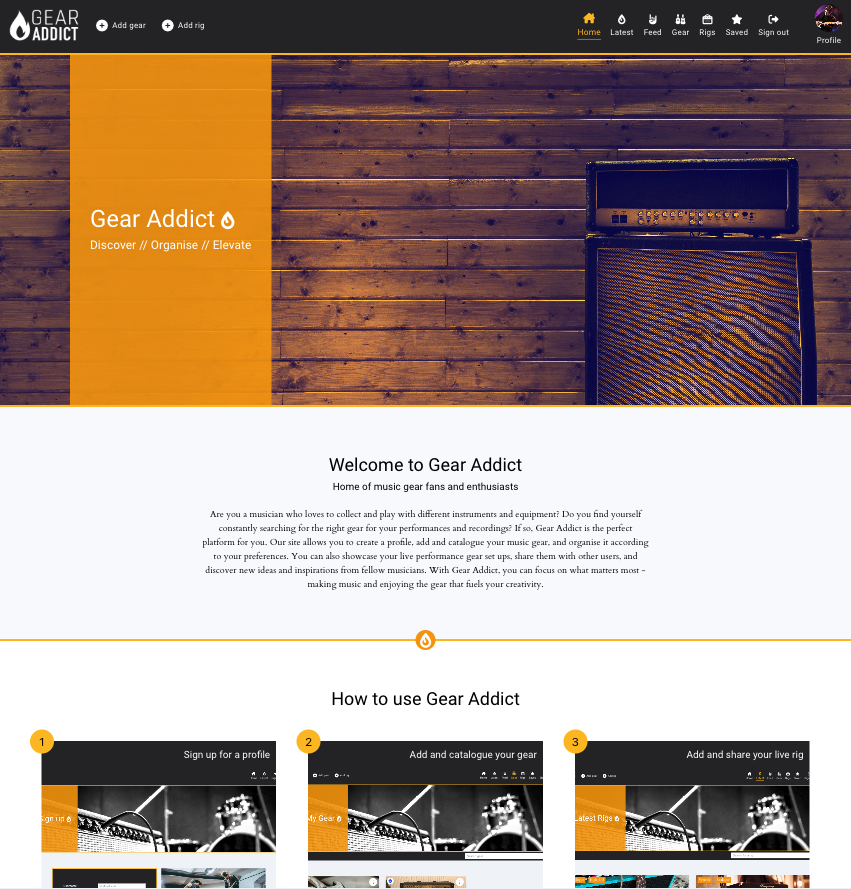

# **Gear Addict - API**

Gear Addict is an online application that allows users to add and categorise their music gear and also share details about their live rigs with the community. Users can interact with other users by becoming a fan, as well as liking, commenting and saving rigs.

This project was built as the final portfolio submission for the [Code Institute](https://codeinstitute.net/) National Diploma in Full Stack Software Development. 

The project has been split into two parts - the front end built with [React](https://react.dev/) and the back end powered by the [Django REST Framework](https://www.django-rest-framework.org/). 

More information on the front end of the site can be found on the front end [README](https://github.com/Matthew-Hurrell/gear-addict/blob/main/README.md).

Link to the live site - [Gear Addict Live Site](https://gear-addict-react.herokuapp.com/)

Link to the live API - [Gear Addict Live API](https://gear-addict.herokuapp.com/)

Link to the front end repository - [Gear Addict Front End Repo](https://github.com/Matthew-Hurrell/gear-addict)

# Contents

* [**User Stories**](<#user-stories>)
* [**Database Schemas**](<#database-schemas>)
* [**Testing**](<#testing>)
    * [**Validator Tests**](<#validator-tests>)
    * [**Manual Tests**](<#manual-tests>)
    * [**Automated Tests**](<#automated-tests>)
    * [**Bugs**](<#bugs>)
* [**Technologies Used**](<#technologies-used>)
    * [Languages](<#languages>)
    * [Frameworks](<#frameworks>)
    * [Software](<#software>)
    * [Libraries](<#libraries>)
* [**Deployment**](<#deployment>)
* [**Credits**](<#credits>)
    * [**Content**](<#content>)
    * [**Media**](<#media>)
    * [**Code**](<#code>)
*  [**Acknowledgements**](<#acknowledgements>)

# User Stories

LINK TO PROJECT BOARD 
LINK TO GITHUB ISSUES

[Back to top](<#contents>)

# Database Schemas

[Back to top](<#contents>)

# Testing

[Back to top](<#contents>)

## Validator Tests

[Back to top](<#contents>)

## Manual Tests

[Back to top](<#contents>)

## Automated Tests

[Back to top](<#contents>)

## Bugs

[Back to top](<#contents>)

# Technologies Used

[Back to top](<#contents>)

## Languages

[Back to top](<#contents>)

## Frameworks

[Back to top](<#contents>)

## Software 

[Back to top](<#contents>)

## Libraries

[Back to top](<#contents>)

# Deployment

[Back to top](<#contents>)

# Credits

[Back to top](<#contents>)

## Content

[Back to top](<#contents>)

## Media

[Back to top](<#contents>)

## Code

[Back to top](<#contents>)

# Acknowledgements

[Back to top](<#contents>)